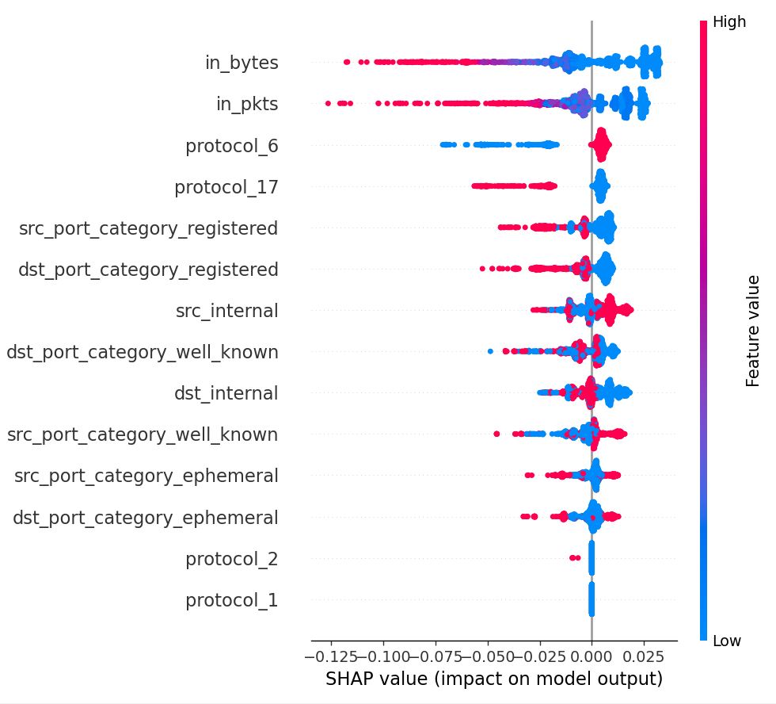

# IsoFlow

IsoFlow is my implementation of a Network Monitoring Intrusion Detection System.
In it's current implementation, it uses an Isolated Forest model in order to classify anomalies within a network.

## Network Integration
There are many ways this could be integrated into a network. In this prototype I have setup a logstash server to receive netflow packets from softflowd programs on all computers involved, the logstash configuration for caputuring the data looks like:

```conf
input {
        udp {
                port => 2055
                codec => netflow {
                        versions => [5, 9, 10]
                }
        }
}

output {
        if "beats_input_codec_plain_applied" not in [tags] {
                file {
                        path => "/var/log/netflows/flows-%{+YYYY-MM-dd}.json"
                        codec => json_lines
                }
        }
}
```

If one were to already have gathered this data, and put 7 days of data into the data directory, the implementation for the continuous Intrusion Detection Prevention could look like:

```conf
input {
        udp {
                port => 2055
                codec => netflow {
                        versions => [5, 9, 10]
                }
        }
}

output {
        if [netflow] {
                http {
                        url => "http://{server_ip}:5000/process_flow"
                        http_method => "post"
                        format => "json"
                }
        }
}
```

## Data Preprocessing
SRC and DST IP's are classified as either internal or external. Additionally protocols (Numbered by IANA Standard) are onehot encoded. Ports are 'One Hot Encoded' into classifications for better analysis via the model.

TBD: Time of day,
## Model Performance
Below is the SHAP analysis of the model, and how much certain features may contribute to classification of anomalies. The model seems to namely focus on bytes and packets, then values registered ports more than well known ports. Before further analysis, more data collection would be preferable (as only working with 100 anomalies in current testing data).




